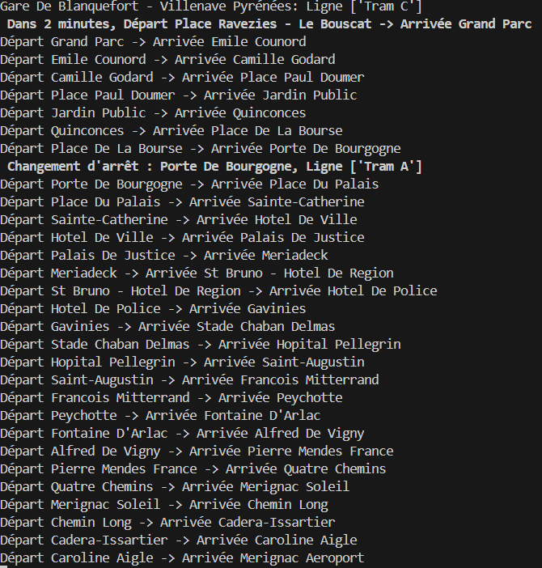

# Traitement des horaires de tramway de Bordeaux via API

## Description du projet
Ce projet est conçu pour interagir avec l'API GeoJSON de l'atelier OPENDATA de Bordeaux Métropole afin de récupérer et traiter les données des différentes lignes de tramway, incluant les arrêts, les itinéraires, les tronçons et les horaires. Il identifie les arrêts de tram les plus proches d'une position GPS donnée, recueille les premiers horaires de passage estimés pour chaque arrêt, et traite les informations des itinéraires et tronçons de tramway pour une analyse ou une visualisation ultérieure.

## Définition de l'Open data et Histoire

Tout d'abord, nous devons définir ce qu'est l'open data.L'open data se réfère à des données accessibles en libre accès, pouvant être utilisées et partagées sans contrainte. Pour être considérée comme ouverte, une donnée doit être accessible, réutilisable et redistribuable par tout utilisateur, sans restriction. Ces critères garantissent son interopérabilité avec des données provenant de différentes sources.

Ce concept englobe une multitude de secteurs, allant de la géolocalisation à la finance, en passant par les sciences, le transport, la culture, le sport, la santé, l'environnement, et bien d'autres encore.

### Histoire en France de l'Open data

L'accès aux données constitue un enjeu crucial pour le fonctionnement démocratique d'une société. En France, depuis 1978, la loi CADA autorise le public à accéder aux informations détenues par l'administration.

Le concept de données ouvertes a émergé à la fin des années 90, avec l'expression "open data" apparaissant pour la première fois en 1995 dans une publication scientifique du National Research Council américain. Cette notion s'inscrit dans une réflexion sur la nature des données en tant que bien commun et sur les risques de privatisation des connaissances.

Il faudra attendre 2005 pour qu'un cadre juridique du soit établi avec l'adoption de l'Open Definition, étendant les principes de l'Open Source aux connaissances. Ces principes reposent sur l'accessibilité, la redistribution et la réutilisation des données par tous, sans discrimination.

La formalisation des principes de l'Open Data intervient deux ans plus tard lors de la rencontre de Sebastopol, définissant huit critères pour qualifier une donnée comme ouverte. Aux États-Unis, ces principes sont adoptés par le gouvernement en 2009 dans le cadre de l'Open Government.

En 2010, la France lance le portail national d'accès aux informations, data.gouv.fr, permettant aux citoyens d'accéder aux ressources de l'administration. La mission Etalab en assure la maintenance depuis sa création en décembre 2011.

En 2013, la charte internationale sur l'Open Data, issue du G8, confère une dimension politique à l'ouverture des données, s'inscrivant dans la continuité des initiatives précédentes.

Aujourd'hui, de nombreux gouvernements à travers le monde reprennent les principes des données ouvertes, la France étant reconnue comme l'un des leaders mondiaux en matière d'ouverture des données publiques.


## Fonctionnalités du projet
- **Identification de l'arrêt le plus proche** : Détermine l'arrêt de tram le plus proche d'une position GPS donnée.
- **Traitement des horaires** : Récupère le premier horaire estimé pour les arrêts de tram.
- **Analyse des itinéraires et tronçons** : Collecte et traite les données des itinéraires et tronçons de tramway pour identifier les connexions et parcours pertinents.

## Sources de données
Le script utilise plusieurs points de terminaison GeoJSON fournis par Bordeaux Métropole pour collecter les données :
- Arrêts (`sv_arret_p`)
- Itinéraires (`sv_chem_l`)
- Lignes (`sv_ligne_a`)
- Tronçons (`sv_tronc_l`)
- Horaires (`sv_horai_a`)
- Relations Itinéraire-Tronçon (`relations/SV_TRONC_L/SV_CHEM_L`)

## Configuration
### Prérequis
- Python 3.x
- Accès à Internet pour récupérer les données depuis l'API de Bordeaux Métropole
- Clé API pour interroger l'API

### Bibliothèques
Assurez-vous d'avoir installé les bibliothèques Python suivantes :
```bash
pip install -r requirements.txt
```

## Utilisation
1. **Configurer les coordonnées GPS** : Définissez les variables `gplat` et `gplng` avec votre position GPS actuelle. Une amélioration possible, est de récupérer depuis une carte, les coordonnées d'un marqueur.

2. **Exécuter le script** : Exécutez le script pour traiter et afficher les données des tramways.
   ```bash
   python Projet.py
   ```

## Fonctions principales
- `get_geojson(url)`: Récupère les données depuis l'endpoint API GeoJSON spécifié.

```
def get_geojson(url):
    response = requests.get(url)
    if response.status_code == 200: #On récupère la réponse get
        return response.json() #On retourne un json
    else:
        print(f"Erreur pour charger les données de {url}") #Si on arrive pas à récupérer alors msg d'erreur
        return None
```

- `haversine_distance(lat1, lon1, lat2, lon2)`: Calcule la distance entre deux coordonnées GPS.

```
def haversine_distance(lat1, lon1, lat2, lon2):
    # Convertir les degrés en radians
    lat1, lon1, lat2, lon2 = map(math.radians, [lat1, lon1, lat2, lon2])
    
    # Différence des coordonnées
    dlat = lat2 - lat1
    dlon = lon2 - lon1
    
    # Formule de Haversine
    a = math.sin(dlat / 2)**2 + math.cos(lat1) * math.cos(lat2) * math.sin(dlon / 2)**2
    c = 2 * math.asin(math.sqrt(a))
    
    # Rayon de la Terre en kilomètres
    r = 6371
    
    return c * r
```

## Exemples de sorties
- Liste des arrêts de tram les plus proches avec l'horaire de passage en minutes "Dans X minutes" de l'arrêt de tram le plus proche.
- Détails des itinéraires de tram partant de l'arrêt le plus proche.




## Fichiers
- `Projet.py`: Script principal contenant toute la logique de traitement.

## Avertissement
Ce script est à des fins éducatives uniquement. Les applications en temps réel peuvent nécessiter de gérer les mises à jour et les modifications fournies par le fournisseur d'API.

## Utilisation des données
Les données utilisées par ce script sont fournies par Bordeaux Métropole via son API GeoJSON. L'utilisation de ces données est soumise aux termes et conditions de Bordeaux Métropole. Les utilisateurs du script doivent également se conformer à ces termes et vérifier les conditions d'utilisation sur le [site officiel](https://opendata.bordeaux-metropole.fr/pages/accueil/) avant d'utiliser les données.

## Contributions
Les contributions au projet sont les bienvenues, mais les contributeurs doivent également s'assurer de respecter les licences des bibliothèques ou des ressources tierces utilisées dans ce projet.