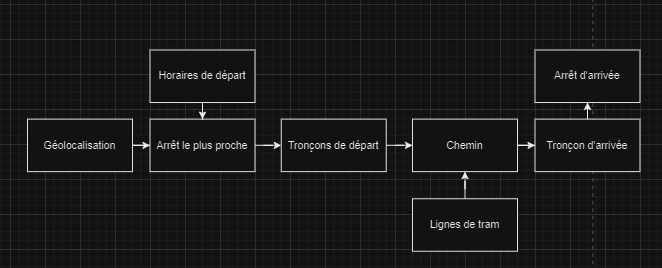

# Traitement des horaires de tramway de Bordeaux via API

## Description du projet
Ce projet est conçu pour interagir avec l'API GeoJSON de l'atelier OPENDATA de Bordeaux Métropole afin de récupérer et traiter les données des différentes lignes de tramway, incluant les arrêts, les itinéraires, les tronçons et les horaires. Il identifie les arrêts de tram les plus proches d'une position GPS donnée, recueille les premiers horaires de passage estimés pour chaque arrêt, et traite les informations des itinéraires et tronçons de tramway pour une analyse ou une visualisation ultérieure. <span style="color:#FFFF00">**À titre d'exemple, ce projet indique le trajet pour aller uniquement jusqu'à l'aéroport de Mérignanc, des [améliorations](#améliorations-possibles) sont possibles, elles sont référées à la toute fin du document. Comme par exemple à partir d'un marqueur afficher l'itinéraire en prenant en compte l'arrêt le plus proche de ce marqueur**.</span>


## Définition de l'Open data et Histoire

Tout d'abord, nous devons définir ce qu'est l'open data.L'open data se réfère à des données accessibles en libre accès, pouvant être utilisées et partagées sans contrainte. Pour être considérée comme ouverte, une donnée doit être accessible, réutilisable et redistribuable par tout utilisateur, sans restriction. Ces critères garantissent son interopérabilité avec des données provenant de différentes sources.

Ce concept englobe une multitude de secteurs, allant de la géolocalisation à la finance, en passant par les sciences, le transport, la culture, le sport, la santé, l'environnement, et bien d'autres encore.

### Histoire en France de l'Open data

L'accès aux données constitue un enjeu crucial pour le fonctionnement démocratique d'une société. En France, depuis 1978, la loi CADA autorise le public à accéder aux informations détenues par l'administration.

Le concept de données ouvertes a émergé à la fin des années 90, avec l'expression "open data" apparaissant pour la première fois en 1995 dans une publication 

Il faudra attendre 2005 pour qu'un cadre juridique du soit établi avec l'adoption de l'Open Definition, étendant les principes de l'Open Source aux connaissances. Ces principes reposent sur l'accessibilité, la redistribution et la réutilisation des données par tous.

La formalisation des principes de l'Open Data intervient deux ans plus tard lors de la rencontre de Sebastopol, définissant huit critères pour qualifier une donnée comme ouverte. Aux États-Unis, ces principes sont adoptés par le gouvernement en 2009 dans le cadre de l'Open Government.

En 2010, la France lance data.gouv.fr, permettant aux citoyens d'accéder aux ressources de l'administration. La mission Etalab en assure la maintenance depuis sa création en décembre 2011.

## Schéma du projet 



## Fonctionnalités du projet
- **Identification de l'arrêt le plus proche** : Détermine l'arrêt de tram le plus proche d'une position GPS donnée.
- **Traitement des horaires** : Récupère le premier horaire estimé pour les arrêts de tram.
- **Analyse des itinéraires et tronçons** : Collecte et traite les données des itinéraires et tronçons de tramway pour identifier les connexions et parcours pertinents.
- **Affichage de l'itinéraire sur une carte** : Affiche l'itinéraire sur une carte avec des couleurs en fonction du Tram. Nous avons les informations des lignes ainsi que des arrêts en cliquant sur les lignes ou les marqueurs.

## Sources de données
Le script utilise plusieurs points de terminaison GeoJSON fournis par Bordeaux Métropole pour collecter les données :
- Arrêts (`sv_arret_p`)
- Itinéraires (`sv_chem_l`)
- Lignes (`sv_ligne_a`)
- Tronçons (`sv_tronc_l`)
- Horaires (`sv_horai_a`)
- Relations Itinéraire-Tronçon (`relations/SV_TRONC_L/SV_CHEM_L`)

## Configuration
### Prérequis
- Python 3.x
- Accès à Internet pour récupérer les données depuis l'API de Bordeaux Métropole
- Clé API pour interroger l'API

### Bibliothèques
Assurez-vous d'avoir installé les bibliothèques Python suivantes :
```bash
pip install -r requirements.txt
```

## Utilisation
1. **Configurer les coordonnées GPS** : Définissez les variables `gplat` et `gplng` avec votre position GPS actuelle.

2. **Exécuter le script** : Une fois le script récupérer, vous avez juste à l'exécuter pour traiter et afficher les données des tramways.

   ```bash
   python Projet.py
   ```

## Fonctions principales
- `get_geojson(url)`: Récupère les données depuis l'endpoint API GeoJSON spécifié.

```
def get_geojson(url):
    response = requests.get(url)
    if response.status_code == 200: #On récupère la réponse get
        return response.json() #On retourne un json
    else:
        print(f"Erreur pour charger les données de {url}") #Si on arrive pas à récupérer alors msg d'erreur
        return None
```

- `haversine_distance(lat1, lon1, lat2, lon2)`: Calcule la distance entre deux coordonnées GPS.

```
def haversine_distance(lat1, lon1, lat2, lon2):
    # Convertir les degrés en radians
    lat1, lon1, lat2, lon2 = map(math.radians, [lat1, lon1, lat2, lon2])
    
    # Différence des coordonnées
    dlat = lat2 - lat1
    dlon = lon2 - lon1
    
    # Formule de Haversine
    a = math.sin(dlat / 2)**2 + math.cos(lat1) * math.cos(lat2) * math.sin(dlon / 2)**2
    c = 2 * math.asin(math.sqrt(a))
    
    # Rayon de la Terre en kilomètres
    r = 6371
    
    return c * r
```

- `callback_label(label)`: Permet d'afficher un label à la carte à savoir : la ligne du Tram, l'arrêt de départ, l'arrêt de changement ou l'arrêt d'arrivée.

```
def callback_label(label):
    label['text'] = label.data
```  

- Dans le code ci-dessous, nous choisissons un lieu d'arrivée en fonction du groupe, il suffit de modifier "T_AEROP" par un autre groupe et on va récupérer les identifiants d'arrivée.
```
for feature in response_arrets["features"]:
    if feature['properties']['groupe'] == "T_AEROP":
        stop_id = feature['properties']['gid']
        stop_ids.append(stop_id)
        stop = feature
```

## Exemples de sorties
- Liste des arrêts de tram les plus proches avec l'horaire de passage en minutes "Dans X minutes" de l'arrêt de tram le plus proche.

- Détails des itinéraires de tram partant de l'arrêt le plus proche.


- Pour un chemin prédéfini, nous allons avoir les chemins avec une couleur adapté à la ligne de tram ainsi que 2 ou 3 marqueurs correspondant aux arrêts de départ, intermédiaire (si changement d'arrêt) et d'arrivée.


## Fichier
- `Projet.py`: Script principal contenant toute la logique de traitement avec les commentaires associées à chaque traitement.


## Explication du code permettant d'afficher sur la carte le chemin

### Recherche des arrêts communs / correspondances
Ici nous allons boucler une première fois sur les chemins triés par ordre croissant sur l'identifiant pour lister toutes les correspondances.
```python
# Collecte des arrêts de départ et d'arrivée pour chaque tronçon
for chemin_info in chemins_info_sorted_gid:
    troncon_found = False
    troncon_mene_au_changement = False
    troncon_part_de_changement = False

    # On parcourt tous les tronçons et on vérifie si un des tronçons fait partie de ceux les plus proches    
    for troncon_gid in chemin_info['troncon']:
        if troncon_gid in closest_stop_troncons:
            troncon_found = True
    
    # Si troncon_found alors on l'ajoute à notre liste d'arrêt de départ
        if troncon_found:
            troncon_info = troncon_dict.get(troncon_gid, {"depart": "Départ inconnu", "arrivee": "Arrivée inconnue"})
            arret_tram_depart.add(troncon_info['depart'])
    
    # Si le tronçon est dans la liste du tronçon d'arrivée, on arrête
        if troncon_gid in arrivee_stop_troncons:
            break
    
    # Vérifier si le chemin contient le tronçon d'arrivée avant de commencer à afficher quoi que ce soit
    if any(troncon_gid in arrivee_stop_troncons for troncon_gid in chemin_info['troncon']):
        for troncon_gid in chemin_info['troncon']:
            troncon_info = troncon_dict.get(troncon_gid, {"depart": "Départ inconnu", "arrivee": "Arrivée inconnue"})
            arret_tram_arrivee.add(troncon_info['depart'])
            
# On repère les correspondances
arrets_communs = arret_tram_depart.intersection(arret_tram_arrivee)
arret_changement = next(iter(arrets_communs), None) 
```

### Recherche des chemins valides
Ici nous allons boucler une seconde fois sur les chemins triés pour lister ici les chemins permettant d'arriver soit à destination ou alors à une correpondance permettant d'arriver à destination.
```python
chemins_valides = []

for chemin_info in chemins_info_sorted_gid:
    troncon_mene_au_changement = False
    troncon_part_de_changement = False
    troncon_found = False

    for troncon_gid in chemin_info['troncon']:
        if troncon_gid in closest_stop_troncons:
            troncon_found = True
        
        # On vérifie si le tronçon mène à l'arrêt de changement puis s'il part de l'arrêt de changement
        if troncon_found:
            troncon_info = troncon_dict.get(troncon_gid, {"depart": "Départ inconnu", "arrivee": "Arrivée inconnue"})
            if troncon_info['arrivee'] == arret_changement:
                troncon_mene_au_changement = True
            if troncon_info['depart'] == arret_changement:
                troncon_part_de_changement = True

    # Si une des 2 conditions validés, on ajoute ce chemin comme validé à la liste
    if troncon_mene_au_changement or troncon_part_de_changement:
        chemins_valides.append(chemin_info)
```

Enfin on va boucler une 3ème fois cette fois-ci sur les chemins valides que nous avons trouvé précédemment.  
L'objectif ici est d'afficher en sortie textuelle l'itinéraire complet du trajet d'un point A à un point B. Et d'un autre côté ajouter les lignes du chemin sur une carte.
Pour cela nous allons mettre des flags pour afficher ou non certaines informations sur la sortie textuelle et la carte, `first_iteration` et `stop_printing` permettent ceci.
```python
# On parcourt la liste des chemins valides
for chemin_info in chemins_valides:
    troncon_found = False
    first_iteration = True # Nécessaire pour afficher l'horaire de départ d'un seul tram

    for troncon_gid in chemin_info['troncon']:
        if troncon_gid in closest_stop_troncons:
            troncon_found = True
            print(f"{chemin_info['chemin_libelle']}: Ligne {chemin_info['ligne_libelle']}") # Affichage du libellé du chemin et de la ligne correspondante
        if troncon_found:
            troncon_info = troncon_dict.get(troncon_gid, {"depart": "Départ inconnu", "arrivee": "Arrivée inconnue"})
            # Print troncon sur la map
            map_widget.set_path(troncon_info['geoshape'], color=colors[chemin_info['ligne_libelle'][0]], data=chemin_info['ligne_libelle'][0], command=callback_label)
            if first_iteration:
                current_time = datetime.now()
                horaire = datetime.fromisoformat(troncon_info['horaire']).replace(tzinfo=None)
                time_diff = round((horaire - current_time).total_seconds() // 60) # Permet de récupérer le temps en minutes dans lequel le tram va partir
                map_widget.set_marker(troncon_info['geoshape'][0][0], troncon_info['geoshape'][0][1], data=troncon_info['depart'], command=callback_label)
                print(f"\033[1m Dans {time_diff} minutes, Départ {troncon_info['depart']} -> Arrivée {troncon_info['arrivee']} \033[0m")
                first_iteration = False # On passe à false pour ne plus afficher le temps dans lequel part les autres tram, uniquement celui le plus proche de nous nous intéresse
            else:
                # Affichage de l'itinéraire jusqu'au changement d'arrêt
                print(f"Départ {troncon_info['depart']} -> Arrivée {troncon_info['arrivee']}")


            if arret_changement == troncon_info['arrivee']:
                for chemin_info in [chemin_info for chemin_info in chemins_info_sorted_gid if any(troncon_gid in arrivee_stop_troncons for troncon_gid in chemin_info['troncon'])][:1]:
                    start_printing = False # Flag pour savoir si on doit afficher ou non le trajet
                    for troncon_gid in chemin_info['troncon']:
                        troncon_info = troncon_dict.get(troncon_gid, {"depart": "Départ inconnu", "arrivee": "Arrivée inconnue"})
                        # Commencer à afficher à partir de l'arrêt de changement
                        if troncon_info['depart'] == arret_changement or start_printing:
                            if not start_printing:
                                print(f"\033[1m Changement d'arrêt : {arret_changement}, Ligne {chemin_info['ligne_libelle']} \033[0m")
                                map_widget.set_marker(troncon_info['geoshape'][0][0], troncon_info['geoshape'][0][1],data=arret_changement, command=callback_label)
                            start_printing = True
                            map_widget.set_path(troncon_info['geoshape'], color=colors[chemin_info['ligne_libelle'][0]], data=chemin_info['ligne_libelle'][0], command=callback_label)
                            print(f"Départ {troncon_info['depart']} -> Arrivée {troncon_info['arrivee']}")
                        if troncon_gid in arrivee_stop_troncons and start_printing:
                            map_widget.set_marker(troncon_info['geoshape'][-1][0], troncon_info['geoshape'][-1][1], data=troncon_info['arrivee'], command=callback_label)
                            break
        if troncon_gid in arrivee_stop_troncons:
            break
```


## Avertissement
Ce script est à des fins éducatives uniquement. Les applications en temps réel peuvent nécessiter de gérer les mises à jour et les modifications fournies par le fournisseur d'API.


## Améliorations possibles

- Définition des coordonnées GPS de départ : Nous pouvons récupérer les coordonnées de la machine sur laquelle le script est exécuté.

- Itinéraire non brut : En plaçant un marqueur sur une carte, récupérer les coordonnées de ce dernier puis calculer la distance afin de trouver l'arrêt le plus proche puis tracer l'itinéraire jusqu'à cet arrêt.

- Estimation de la distance : À partir de l'arrêt de départ, calculer la distance en parcourant le chemin jusqu'à l'arrivée et l'afficher en tant que label sur la carte.

## Utilisation des données
Les données utilisées par ce script sont fournies par Bordeaux Métropole via son API GeoJSON. L'utilisation de ces données est soumise aux termes et conditions de Bordeaux Métropole. Les utilisateurs du script doivent également se conformer à ces termes et vérifier les conditions d'utilisation sur le [site officiel](https://opendata.bordeaux-metropole.fr/pages/accueil/) avant d'utiliser les données.

## Contributions
Les contributions au projet sont les bienvenues, mais les contributeurs doivent également s'assurer de respecter les licences des bibliothèques ou des ressources tierces utilisées dans ce projet.